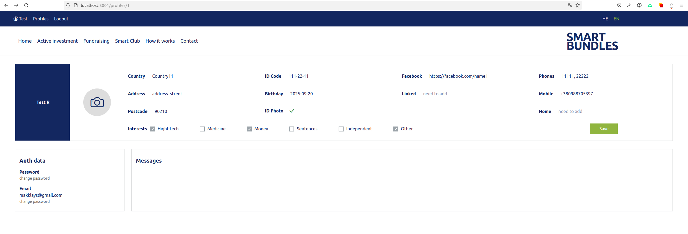
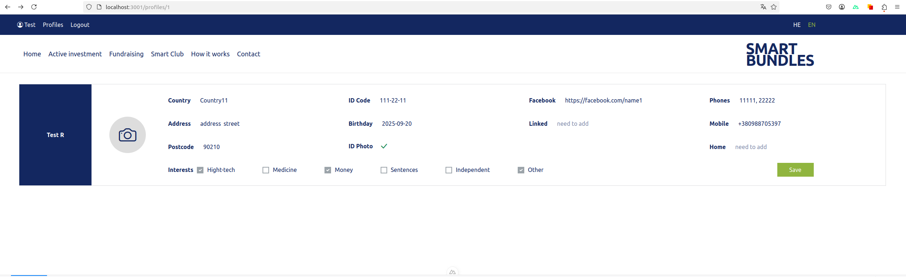
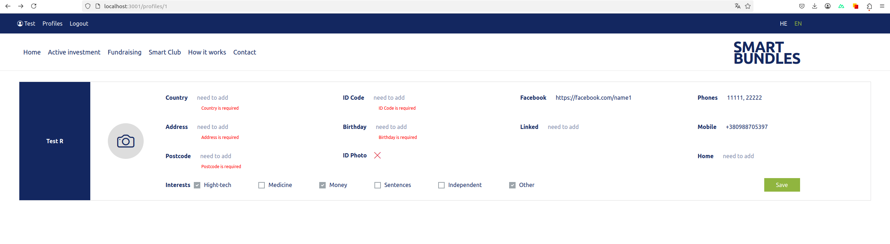
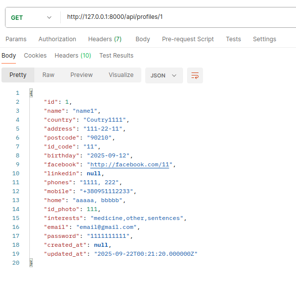
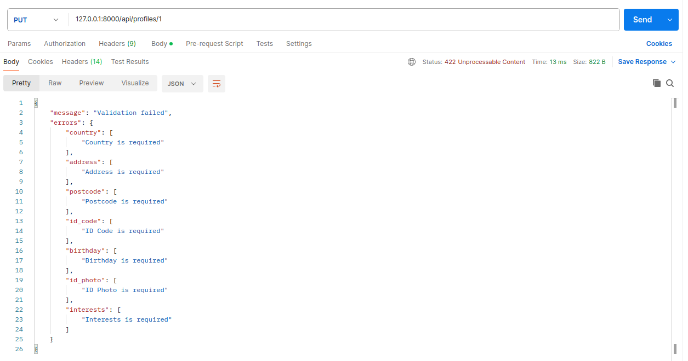

# Laravel + Nuxt 3

This is a <b>Laravel + Nuxt 3</b> project with sample code to demonstrate my knowledge and technical skills (for SMART BUNDLES).

### Frontend (Nuxt 3)

    
    
    

The validation on Laravel (RequestForm from backend to frontend)

    

### Backend (Laravel with methods GET, PUT)
(this is a simple example without JWT or Bearer token, but it is possible to add them - simple example) 
 

    

Validation has been added for the form fields (required field and other validation)

    

