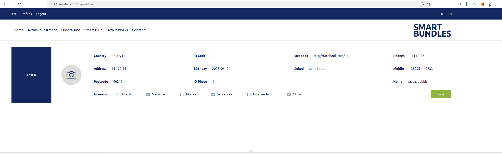
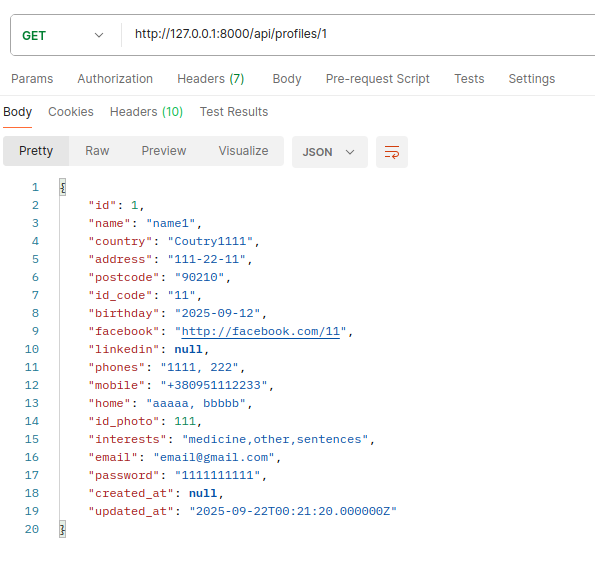
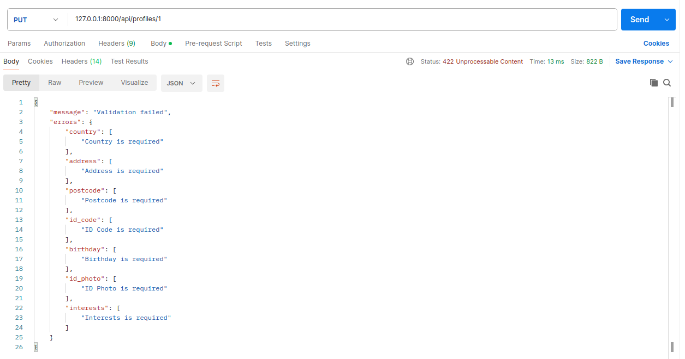

# Laravel + Nuxt 3

This is a <b>Laravel + Nuxt 3</b> project with sample code to demonstrate my knowledge and technical skills (for SMART BUNDLES).

Frontend (Nuxt 3)

    

Backend (Laravel with methods GET, PUT)

    
    

